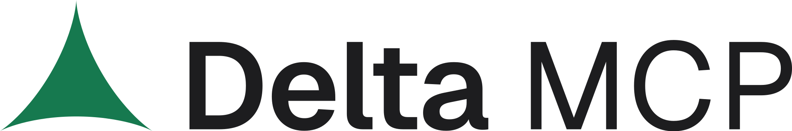
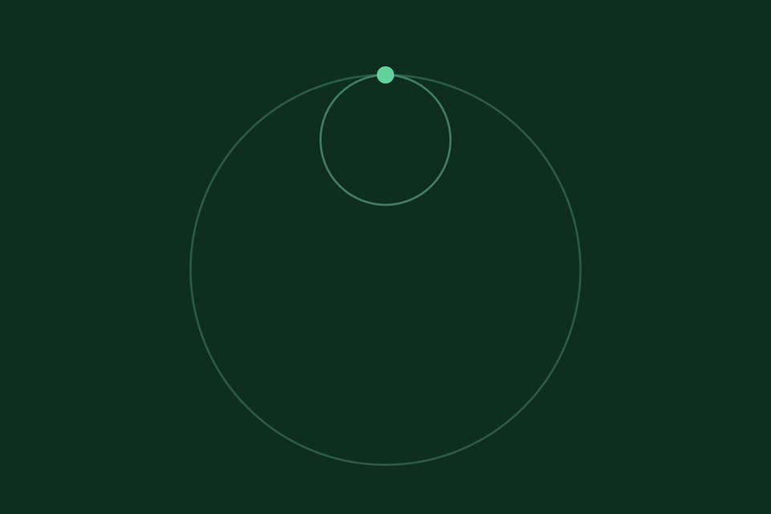
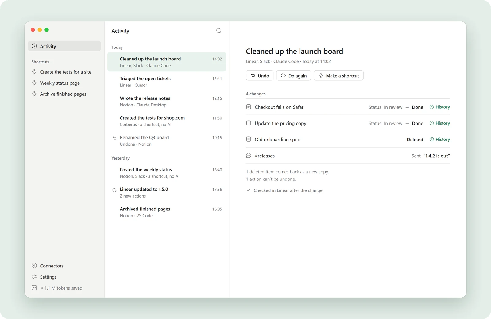
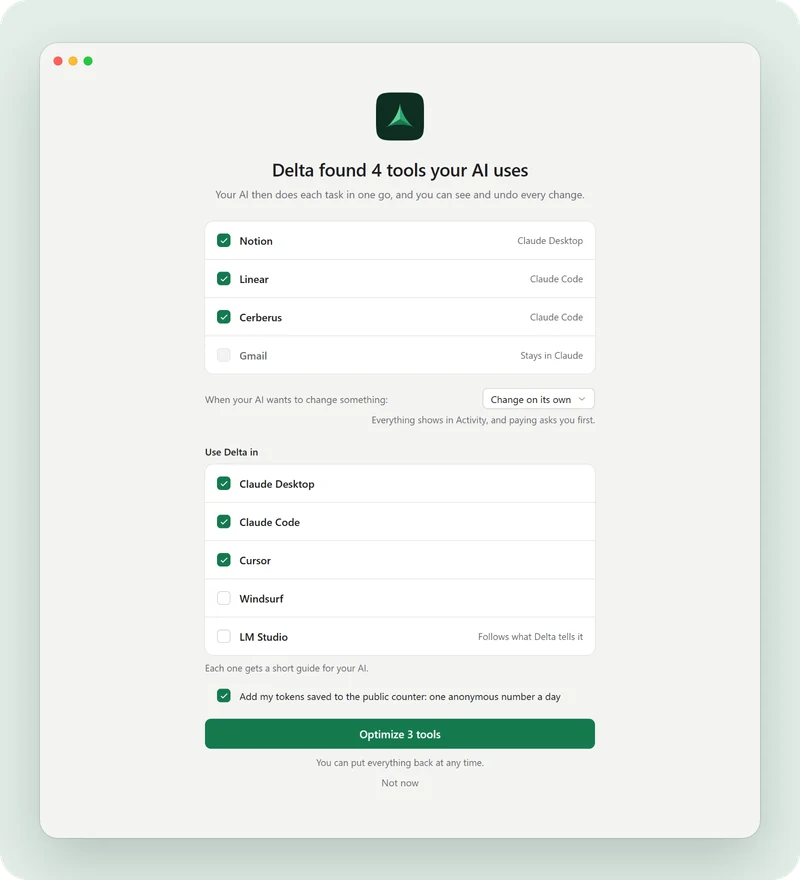

<h1>
  <picture>
    <source media="(prefers-color-scheme: dark)" srcset="assets/logo-dark.svg">
    
  </picture>
</h1>

<strong>The free app that makes your AI’s MCP tools faster, cheaper and undoable.</strong>

  <a href="https://mcpdelta.com">Website</a> ·
  <a href="https://mcpdelta.com/how-it-works">How it works</a> ·
  <a href="https://mcpdelta.com/benchmarks">Benchmarks</a> ·
  <a href="https://mcpdelta.com/docs">Docs</a> ·
  <a href="https://mcpdelta.com/download">Download: coming soon</a>

Delta MCP is a free app that sits between your AI apps and their MCP servers. Your AI does each task as one program instead of one tool call per step. Delta MCP checks it before the first call, makes the fewest calls, all or nothing, reads the result back, records it and can undo it. It works with the MCP servers you already use.

> **Coming soon.** Delta MCP is almost here, for macOS, Windows and Linux: free, no account. Follow the launch and you’ll know the moment it’s out, with no email address: [RSS](https://mcpdelta.com/feed.xml), or **Watch → Custom → Releases** on this repository.

  

## What it does

Your AI becomes a developer, not an executor. Instead of reading, deciding, calling one tool, waiting and reading again, it writes the whole task once.

1. **One program per task, not one call per step.** Your AI writes the task as one short program. Your MCP servers stay exactly as they are, and every original tool stays callable by name.
2. **Checked, applied all or nothing, read back.** Delta MCP checks the program before the first call, makes the fewest calls, applies them all or nothing, then reads the result back.
3. **Recorded in Activity, and undoable.** Every task lands in Activity with each change before and after. Undo it in one click. When something can’t be undone, like a message already sent, Delta MCP tells you.

  <picture>
    <source media="(prefers-color-scheme: dark)" srcset="assets/activity-dark.webp">
    
  </picture>

## Measured: up to 24.1× fewer tokens

Same result, up to 24.1× fewer tokens. With Delta MCP, multi-step tasks use far fewer tokens, cost less and finish as fast or faster, with the same end result, checked in the service itself. 8 scenarios, each run with and without Delta MCP, in Claude Code with Sonnet 5.5.

| 3.3–24.1× | 1.4–8.1× | up to 4.4× | 152 / 152 |
|:--|:--|:--|:--|
| fewer billed tokens on multi-step tasks | lower cost on multi-step tasks, even in the strictest cache case | faster on multi-step tasks, and no scenario is slower | tools still declared and callable through Delta MCP |

  <picture>
    <source media="(prefers-color-scheme: dark)" srcset="assets/bench-dark.png">
    
  </picture>

| Task | Server | Billed tokens | Model calls |
|:--|:--|:--|:--|
| Fix a release, as text | Cerberus, 152 tools | **24.1× fewer** | 26 → 4.5 |
| Add tests, as text | Cerberus, 152 tools | **15.8× fewer** | 16.6 → 4 |
| Fix a release, as code | Cerberus, 152 tools | **13.4× fewer** | 26 → 6.5 |
| Clean up 20 late tickets | A ticket manager | **4.8× fewer** | 5 → 2 |
| Log in, add 3 contacts, list them | Microsoft Playwright MCP | **3.9× fewer** | 12.6 → 4 |
| Make 6 changes to a task list | taskqueue-mcp | **3.3× fewer** | 5.6 → 2 |
| A documentation question | Context7 | **1.2× fewer** | 4 → 3 |
| A one-step question | Playwright, books.toscrape.com | 1.25× more | 4 → 3 |

Averages of 2 to 3 runs per variant. A single one-step question costs more, because your AI reads Delta MCP’s short description on every call: the gain is on tasks with several steps. A benchmark on the biggest MCP servers will be published when Delta MCP is released.

**[All benchmarks, with the method →](https://mcpdelta.com/benchmarks)**

## Works with 12 AI apps

Claude Desktop, Claude Code, Cursor, VS Code, Windsurf, Gemini CLI, Cline, Roo Code, LM Studio, Amazon Q, Codex and Zed. Delta MCP switches the first ten over for you; Codex and Zed are set up by hand for now. Your MCP servers stay exactly as they are. See [how each app is switched over](https://mcpdelta.com/docs/supported-apps).

## Download: coming soon

The free app for macOS, Windows and Linux is coming soon. There is nothing to install yet, and this repository does not contain the app.

| Option | Where |
|:--|:--|
| **Download page** | [mcpdelta.com/download](https://mcpdelta.com/download) |
| **Follow with RSS** | [mcpdelta.com/feed.xml](https://mcpdelta.com/feed.xml) |
| **Watch releases here** | **Watch → Custom → Releases**, on this repository |

<!-- At launch: the download command goes here. It is not available yet. -->

### Two minutes to set up

1. **Download and open Delta MCP.** Free, for Mac, Windows and Linux.
2. **It finds the tools your AI uses.** Its MCP servers, in Claude Desktop, Claude Code, Cursor, VS Code and 8 more apps, checked live.
3. **Click Optimize.** Your AI uses them through Delta MCP from then on. Put everything back whenever you like.

  <picture>
    <source media="(prefers-color-scheme: dark)" srcset="assets/first-launch-dark.webp">
    
  </picture>

## Questions

### What is Delta MCP?

Delta MCP is a free app that sits between your AI apps and their MCP servers. Your AI does each task as one program instead of one tool call per step. Delta MCP checks it before the first call, makes the fewest calls, all or nothing, reads the result back, records it and can undo it. It works with the MCP servers you already use.

### Is Delta MCP really free?

Yes. Every feature is in the free app, with no account and no limit on servers. See [pricing](https://mcpdelta.com/pricing).

### Is Delta MCP open source?

No. Delta MCP is a free app, and its source code is not public. How it works is written out in the docs, how it is measured is on the benchmarks page, and everything it does on your computer is recorded in Activity. This repository only presents the app.

### Which AI apps does Delta MCP work with?

Delta MCP works with 12 AI apps: Claude Desktop, Claude Code, Cursor, VS Code, Windsurf, Gemini CLI, Cline, Roo Code, LM Studio, Amazon Q, Codex and Zed. It switches the first ten over for you; Codex and Zed are set up by hand for now.

### Does Delta MCP save tokens?

Yes, on tasks with several steps: 3.3 to 24.1 times fewer tokens in our measurements. A single one-step question costs more (about 1.25 times the tokens), because your AI reads Delta MCP’s short description on every call.

### Does Delta MCP send my data anywhere?

No. Delta MCP runs on your computer and talks to your servers directly; your tools, tasks and history never leave it. Besides a check for new versions, which sends nothing about you, the only thing that can be sent is one anonymous number a day, your tokens saved: you choose at first launch, and it’s off in Settings in one click. The complete list is on the [security page](https://mcpdelta.com/security).

### Do I need to change my MCP servers?

No. Delta MCP uses them exactly as they are. Every original tool stays callable by name: 152 of 152 on the largest server we tried.

### Do I still need Delta MCP if my AI app has Tool Search?

Yes, on tasks with several steps. Tool Search keeps the list of tools short, but every step is still a separate request to the model. Delta MCP removes those requests: your AI writes the task as one program. Our measurements were taken with Tool Search on, so the savings come on top of it.

### Is Delta MCP an MCP gateway or proxy?

It is closer to a local proxy than to an enterprise gateway. Like a proxy, it puts your MCP servers behind one entry in your AI apps. Unlike a gateway, it is a free app on your own computer, with no service to run. Its main job is different: your AI writes each task as one program, so it makes far fewer calls.

### How do I stop using Delta MCP?

Settings, then Put everything back. Each connector returns to your AI apps exactly as it was; Delta MCP keeps a copy of every file it changed.

### When is Delta MCP coming out?

Soon. Follow the launch with [RSS](https://mcpdelta.com/feed.xml) or **Watch → Custom → Releases** on this repository, and you’ll know the moment it’s out.

## Learn more

- [How Delta MCP works](https://mcpdelta.com/how-it-works): your AI writes the program.
- [Docs](https://mcpdelta.com/docs), [security and privacy](https://mcpdelta.com/security) and [pricing](https://mcpdelta.com/pricing).
- [How to reduce MCP token usage, and why MCP burns tokens](https://mcpdelta.com/guides/reduce-mcp-token-usage)
- [Claude Code usage limit reached? What your MCP servers cost](https://mcpdelta.com/guides/claude-code-usage-limit-mcp)
- [MCP config file locations: Claude, Cursor, VS Code and more](https://mcpdelta.com/guides/mcp-clients)
- [MCP vs CLI for AI agents: where the token bill comes from](https://mcpdelta.com/guides/mcp-vs-cli)

## Delta MCP in your language

[English](https://mcpdelta.com) ·
[中文](https://mcpdelta.com/zh) ·
[हिन्दी](https://mcpdelta.com/hi) ·
[Español](https://mcpdelta.com/es) ·
[العربية](https://mcpdelta.com/ar) ·
[Français](https://mcpdelta.com/fr) ·
[বাংলা](https://mcpdelta.com/bn) ·
[Português](https://mcpdelta.com/pt) ·
[Bahasa Indonesia](https://mcpdelta.com/id) ·
[اردو](https://mcpdelta.com/ur) ·
[Русский](https://mcpdelta.com/ru) ·
[Deutsch](https://mcpdelta.com/de) ·
[Italiano](https://mcpdelta.com/it) ·
[Nederlands](https://mcpdelta.com/nl) ·
[Ελληνικά](https://mcpdelta.com/el)

## Security

To report a problem, write to us privately at [contact@mcpdelta.com](mailto:contact@mcpdelta.com). See [SECURITY.md](SECURITY.md).

## License

Delta MCP is proprietary software and is not open source. This repository only presents the app: it contains no source code. See [NOTICE](NOTICE).

---

© 2026 Delta MCP. All rights reserved. This repository only presents the app.

